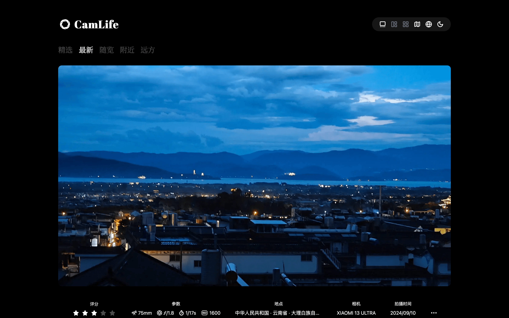

<div align="center">
  
  <h1>Camlife</h1>
  <p>Camlife is a website that showcases photography works for everyone who loves photography</p>
  
</div>

## ✨ Features

- [ ] 🎨 Clean and minimalist design
- [ ] 📱 Responsive design for all devices
- [ ] 🖼️ Automatic EXIF data extraction from photos
- [ ] 🔐 Secure authentication with Better Auth
- [ ] ☁️ Cloud storage with Cloudflare R2
- [ ] 📡 RSS feed
- [ ] ✨ and more...

## 🎬 Showcase

- https://camlife.app

> welcome to add your website to the list ❤️

## 🔨 Tech Stack

- ⚡ Framework - [Next.js](https://nextjs.org)
- 🧩 Language - [TypeScript](https://www.typescriptlang.org)
- 🌬️ Styling - [Tailwind CSS](https://tailwindcss.com)
- 🎛️ UI Library - [shadcn/ui](https://ui.shadcn.com)
- 🐻 State Management - [Zustand](https://zustand-demo.pmnd.rs)
- 🐘 Database - [Postgres](https://www.postgresql.org)
- 🌧️ ORM - [Drizzle](https://orm.drizzle.team)
- 🔑 Auth - [Better Auth](https://www.better-auth.com)
- ✅ Schema Validations - [Zod](https://zod.dev)
- 🔗 API Layer - [tRPC](https://trpc.io)
- 🧹 Formatter and Linter - [Biome](https://biomejs.dev)
- 🪝 Git hooks - [Lefthook](https://lefthook.dev)

## 💡 Inspired Projects

- [Camarts](https://camarts.app)
- [exif-photo-blog](https://github.com/sambecker/exif-photo-blog)
- [photography-website](https://github.com/ECarry/photography-website)
- [PicImpact](https://github.com/besscroft/PicImpact)
- [Afilmory](https://github.com/Afilmory/afilmory)

## 🚀 Getting Started

[](https://vercel.com/new/clone?repository-url=https://github.com/sun0225SUN/camlife)

## 💻  Local development

1. Clone the repository

```bash
git clone https://github.com/sun0225SUN/camlife.git

cd camlife
```

2. Create a `.env` file in the root directory

```bash
# Database
DATABASE_URL=your_database_url

# Cloudflare R2
CLOUDFLARE_R2_ENDPOINT=
CLOUDFLARE_R2_ACCESS_KEY_ID=
CLOUDFLARE_R2_SECRET_ACCESS_KEY=
CLOUDFLARE_R2_BUCKET_NAME=
CLOUDFLARE_R2_PUBLIC_URL=

# Mapbox
NEXT_PUBLIC_MAPBOX_ACCESS_TOKEN=

# Auth
# You can generate a random secret using `openssl rand -base64 32`
BETTER_AUTH_SECRET=
BETTER_AUTH_URL=http://localhost:3000
```

3. Install dependencies

```bash
bun install
```

4. Set up the database

```bash
bun db:push
```

5. Start the development server

```bash
bun run dev
```

Open: `http://localhost:3000` to see your application.

## 📝 License

This project is licensed under the [GNU General Public License v3.0](LICENSE).

## 💖 Support

If you find this project helpful, please give it a ⭐️ on GitHub!

## 🤝 Contributing

Contributions are welcome! Feel free to open issues and pull requests.

## 📊 Repository Status


## ⭐ Star History

[](https://github.com/sun0225SUN/camlife)